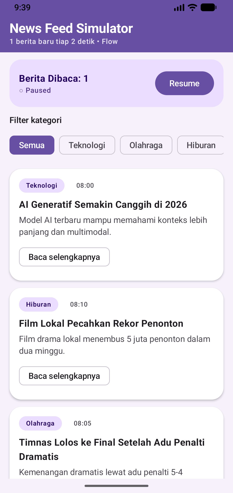

# Tugas 2 - NewsFeedSimulator

**Nama:** Muhammad Arfa Raditya
**NIM:** 124140015
**Kelas:** RA

## Deskripsi

Aplikasi simulasi news feed real-time (1 berita/2 detik) dengan filter kategori, counter bacaan berbasis StateFlow, dan detail berita async.

## Fitur Sesuai Rubrik

1. **Flow** — `shared/.../data/NewsDataSource.kt`: `flow { }` + `emit()` + `delay(2_000)`, di-`collect()` di ViewModel.
2. **Operators** — `shared/.../viewmodel/NewsViewModel.kt`: `.filter` kategori, `.map` ke UiModel, `.onEach` logging, `.catch` error handling.
3. **StateFlow** — `_readCount` (`MutableStateFlow`, private) diekspos read-only via `asStateFlow()`; naik 1 per berita unik yang dibuka.
4. **Coroutines** — `suspend fun fetchNewsDetail()` + `delay()` di repository, dipanggil paralel via `async`/`await` di `openNewsDetail()`, lengkap dengan loading, cancellation, dan try-catch.

## Cara Menjalankan

1. Buka folder `Tugas2_124140015_MuhammadArfaRaditya` di Android Studio.
2. Pilih konfigurasi `androidApp` dan emulator tujuan.
3. Tekan **Run ▶**.

## Screenshot

